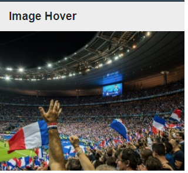
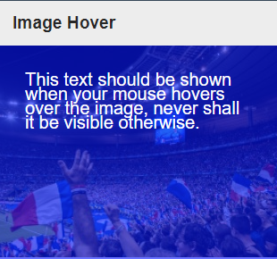
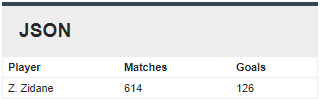

# Test 1

### Introduction

Testing:
* elegant code
* efficient code
* semantically correct js
* semantically correct css

### Beware

* It's wise to access data as a relative path `./data/stats.json`.

Consider:
* Accessibility
* Security
* Performance

### 

**Do:**

* Write your code in functional js that will work in modern browsers.
* Place your code in `script.js` and `style.css` files.

**Don't:**

* Alter the `style.css` file in the __css__ directory in any way.
* Alter the raw HTML markup in `index.html`.

### Tasks

There are 2 parts to this test:

* [image-hover](#image-hover)
* [json](#json)

#### Image Hover

* On page load, we should see:

  

* When the user hovers over the image, the "hover-text" div should appear along with white text on a blue transparent background, fitting exactly over the image - like this:

  

* When the mouse no longer hovers over the image, just the image should be displayed.

#### JSON

* The information in [players.json](data/players.json) and [stats.json](data/stats.json) should be fetched.
* The table shows the players with their stats. If stats are missing the player is not displayed
* The JSON files should be parsed and their data should be displayed as follow:

  

using the `short_name`, `matches`, and `goals` fields;